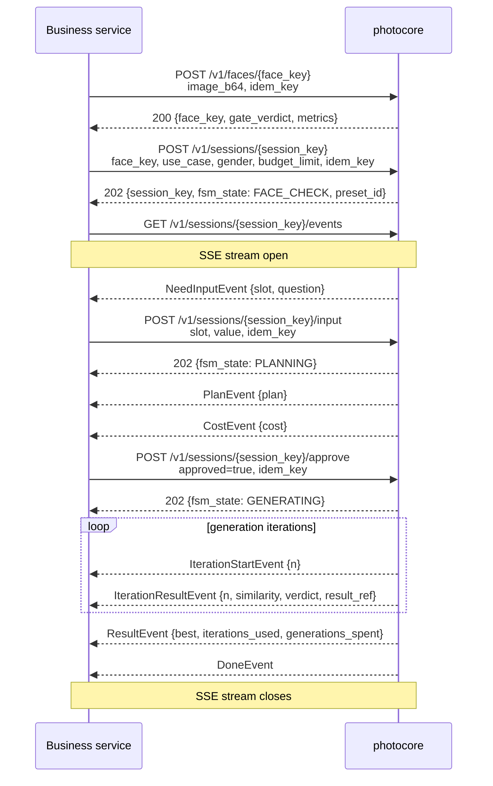

# API reference

Base path: `/v1`. All request/response bodies are JSON.  
Every mutation accepts an `idem_key` field — executed at-most-once; retries replay the committed response byte-for-byte.

## Endpoints

| Method | Path | FSM precondition | Idempotent | Description |
|--------|------|-----------------|-----------|-------------|
| `POST` | `/v1/faces/{face_key}` | — | ✓ | Ingest reference photo, run quality gate, store face profile |
| `POST` | `/v1/sessions/{session_key}` | face passed gate | ✓ | Start generation session, spawn FSM |
| `POST` | `/v1/sessions/{session_key}/input` | `NEED_INPUT` | ✓ | Submit free-form scene answer, resume FSM |
| `POST` | `/v1/sessions/{session_key}/approve` | `AWAITING_APPROVAL` | ✓ | Approve or reject cost estimate |
| `POST` | `/v1/sessions/{session_key}/cancel` | any non-terminal | naturally | Cancel session |
| `GET` | `/v1/sessions/{session_key}` | — | — | Read current state snapshot |
| `GET` | `/v1/sessions/{session_key}/events` | — | — | SSE stream (supports `Last-Event-ID`) |
| `GET` | `/healthz` | — | — | Liveness probe |
| `GET` | `/readyz` | — | — | Readiness probe (checks Redis + preset library) |

## Happy-path sequence

## SSE event types

| Event type | When emitted |
|-----------|-------------|
| `stage` | Internal FSM transitions |
| `need_input` | Preset requires free-form scene description |
| `plan` | Shoot plan ready |
| `cost` | Cost estimate ready |
| `iteration_start` | Generator called for iteration n |
| `iteration_result` | Iteration n complete (success or error) |
| `retry` | Retrying after subthreshold result |
| `result` | Best frame selected, session deliverable |
| `failed` | Terminal failure with `FailureCode` |
| `done` | Session complete |

Reconnect with `Last-Event-ID` header to resume the stream from the last received event.

## Gate verdicts

| Verdict | Meaning | Recommended action |
|---------|---------|--------------------|
| `PASSED` | Clean photo | Proceed |
| `SOFT` | Usable but sub-ideal (blur, exposure, pose) | Surface risk to user and proceed, or ask for a better photo |
| `BELOW_FLOOR` | Unusable (no face, extreme occlusion, too small) | Reject, ask user to re-shoot |
