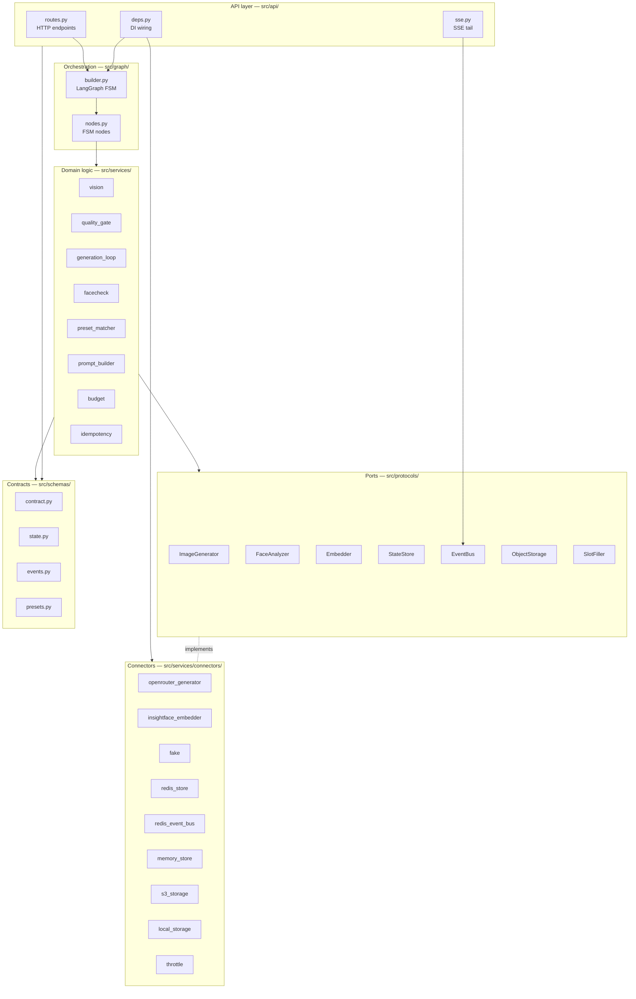

# Architecture

## Layer diagram

Dependencies point strictly inward toward `schemas/` and `protocols/`.



## Connector matrix

| Connector | Implements | Active when |
|-----------|-----------|-------------|
| `openrouter_generator` | `ImageGenerator` | `FAKE_CONNECTORS=false` (default) |
| `throttle` | `ImageGenerator` (wrapper) | wraps the real or fake generator |
| `insightface_embedder` | `FaceAnalyzer`, `Embedder` | `FAKE_CONNECTORS=false` |
| `fake` | `FaceAnalyzer`, `ImageGenerator`, `Embedder` | `FAKE_CONNECTORS=true` |
| `redis_store` | `StateStore` | `REDIS_URL` set |
| `redis_event_bus` | `EventBus` | `REDIS_URL` set |
| `memory_store` | `StateStore`, `EventBus` | `REDIS_URL` unset (dev fallback) |
| `s3_storage` | `ObjectStorage` | `OBJECT_STORAGE=s3` |
| `local_storage` | `ObjectStorage` | `OBJECT_STORAGE=local` (default) |
| `openrouter_slot_filler` | `SlotFiller` | `FAKE_CONNECTORS=false` |

## Data flow (one session)

```
POST /v1/faces  →  Vision (FaceAnalyzer port)  →  quality gate  →  FaceProfile → StateStore
POST /v1/sessions  →  preset_matcher  →  background task spawned
  background: FSM runs
    ask node    → interrupt → resume on POST /input
    approve node → interrupt → resume on POST /approve
    generate node → generation_loop
      loop: prompt_builder → ImageGenerator → facecheck → keep-best → budget.charge
      each iteration → EventBus.publish
GET /events  →  SSE tail (EventBus)  →  client
```
