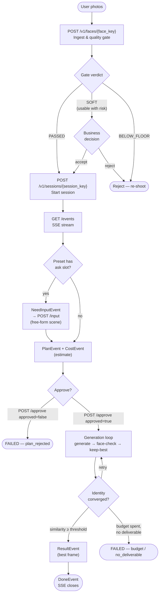

# Business flow

End-to-end journey from user photos to delivered result.

## Key invariants

| Rule | Why |
|------|-----|
| Face key is scoped to one identity; session key scopes one shoot | Allows retries without re-uploading the photo |
| Every mutation carries `idem_key` | Guarantees at-most-once execution across network retries |
| Budget is the number of **paid** generator calls, not iterations | Caller controls spend ceiling; the loop exhausts it before declaring failure |
| Best result is kept even if the loop fails to converge | Caller always gets something if at least one frame passed SOFT |
