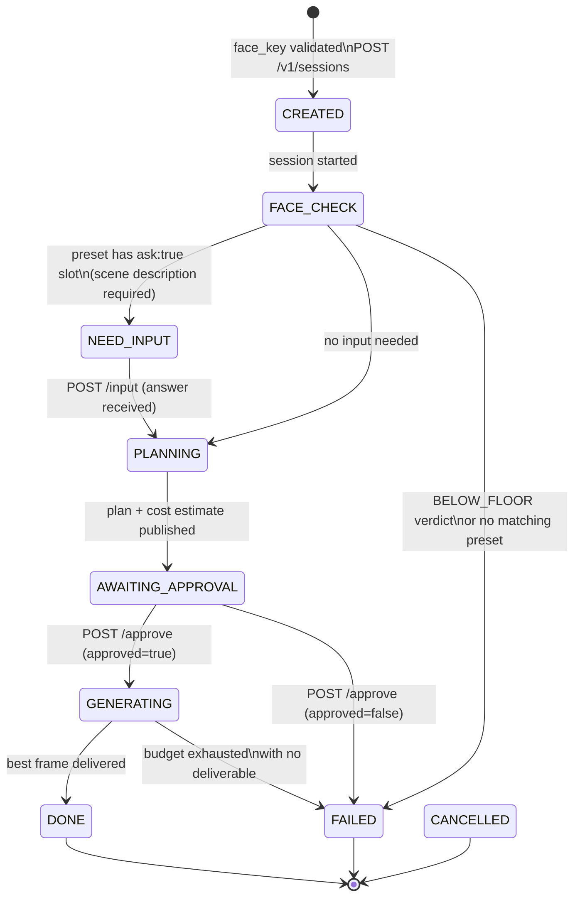

# Session FSM

LangGraph state machine that drives each photoshoot session.

> **CANCELLED** is a caller-initiated terminal state — any non-terminal session can be
> cancelled via `POST /v1/sessions/{session_key}/cancel`. It is set outside the FSM.

## State descriptions

| State | Meaning | Resumed by |
|-------|---------|-----------|
| `CREATED` | Session record created, face profile loaded | — (internal) |
| `FACE_CHECK` | Quality gate evaluated | — (internal) |
| `NEED_INPUT` | Waiting for free-form scene description | `POST /input` |
| `PLANNING` | Prompt built, cost estimated | — (internal) |
| `AWAITING_APPROVAL` | Waiting for caller to confirm cost | `POST /approve` |
| `GENERATING` | Generation loop running | — (internal) |
| `DONE` | Session complete, result available | — |
| `FAILED` | Terminal failure (see `FailureCode`) | — |
| `CANCELLED` | Caller-cancelled | — |

## Failure codes

| Code | Trigger |
|------|---------|
| `INPUT_REJECTED` | Free-form input contained prompt injection |
| `NO_PRESET` | No preset matched use_case + gender |
| `SCENE_REJECTED` | Scene text failed sanitisation after max re-asks |
| `PLAN_REJECTED` | Caller sent `approved=false` |
| `BUDGET_EXHAUSTED` | All paid slots used, no frame delivered |
| `NO_DELIVERABLE` | Loop ended, best similarity below floor |
| `GENERATION_FAILED` | Generator returned permanent error |
| `REFERENCE_MISSING` | face_key not found in store |
| `WALL_CLOCK` | Session exceeded `SESSION_WALL_CLOCK_SECONDS` |
| `CANCELLED` | Caller cancelled |
| `INTERNAL` | Unexpected error |
